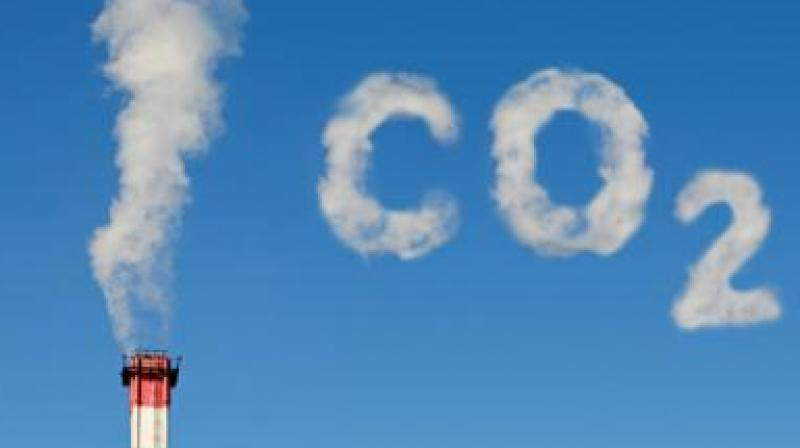

# Exercise Badges

    

# Assessing the Role of Individual Consumption Behavior in Climate Change

_Image credit: [DECCAN Chronicle](https://www.deccanchronicle.com/lifestyle/pets-and-environment/100218/ecoistic-greenhouse-gas-blues-fighting-the-emission-war.html)_

## Description

This project aims to explore how individual consumption patterns impact carbon emissions and how this understanding can guide effective climate change mitigation strategies. By analyzing data on consumption intensities and the environmental impacts of representative products, the project seeks to identify the primary drivers of carbon emissions associated with individual consumption across various categories.

## Datasources

### Datasource1: Eurostat - Consumption footprint

- Metadata URL: https://ec.europa.eu/eurostat/cache/metadata/en/cei_gsr010_esmsip2.htm
- Data URL: https://ec.europa.eu/eurostat/api/dissemination/sdmx/2.1/data/cei_gsr010?format=SDMX-CSV&compressed=false
- Data Type: CSV

The indicator consumption footprint estimates the environmental impacts of EU and Member States consumption by combining data on consumption intensity and environmental impacts of representative products. The indicator covers five areas of consumption: food, mobility, housing, appliances, and household goods. Consumption intensities are calculated based on consumption statistics.

### Datasource2: Eurostat - EU CO2 emissions from the production and consumption (footprint) perspectives (FIGARO application)

- Metadata URL: https://ec.europa.eu/eurostat/cache/metadata/en/env_ac_co2fp_esms.htm
- Data URL: https://ec.europa.eu/eurostat/api/dissemination/sdmx/2.1/data/egi_co2_1?format=SDMX-CSV&compressed=false
- Data Type: CSV

The dataset presents modelling estimates of carbon dioxide (CO2) 'embodied' in products (goods and services) for final demand - also referred to as 'footprints'. The estimates are the result of environmental input-output modelling and cover the entire world economy.
